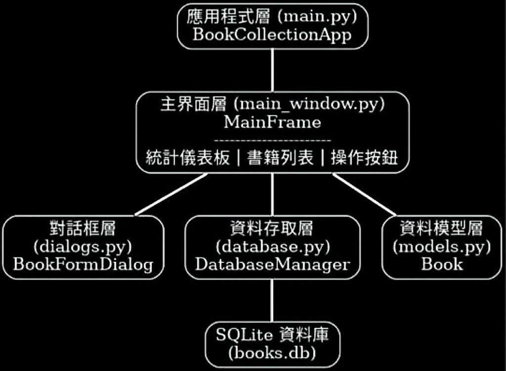

# 個人化書籍收藏管理系統

## 專案概述

這是一個使用 Python、SQLite 和 wxPython 開發的桌面應用程式，讓使用者能夠有效管理其書籍收藏。系統採用物件導向程式設計 (OOP) 概念，提供完整的書籍管理功能。

## 功能特色

### 1. 書籍管理
- **新增書籍**: 添加新書到收藏中，包含書名、作者、出版年份、閱讀狀態和評分
- **編輯書籍**: 修改現有書籍的資訊
- **刪除書籍**: 移除不需要的書籍 (含確認對話框)
- **瀏覽書籍**: 以表格形式顯示所有書籍資訊

### 2. 搜尋功能
- 支援按書名或作者搜尋
- 即時搜尋結果顯示
- 重新整理功能可快速回到完整列表
- 搜尋結果計數顯示

### 3. 統計儀表板
- **即時統計**: 顯示總書籍數、已讀、閱讀中、未讀的數量
- **彩色編碼**: 不同狀態使用不同顏色標示
- **閱讀進度**: 狀態列顯示閱讀完成百分比
- **動態更新**: 任何操作後統計數據即時更新

### 4. 匯出功能
- 將書籍清單匯出為 CSV 格式
- 支援自訂儲存位置
- 包含完整的書籍資訊

### 5. 資料驗證與錯誤處理
- 輸入資料驗證 (書名、作者不可為空，年份必須為有效數字等)
- 友善的錯誤訊息提示
- 完整的異常處理機制
- 狀態列即時回饋

## 技術規格

### 開發環境
- **程式語言**: Python 3.x
- **GUI 框架**: wxPython
- **資料庫**: SQLite (使用內建 `sqlite3` 模組)
- **程式架構**: 物件導向程式設計 (OOP)

### 系統需求
- Python 3.6 或更高版本
- wxPython 4.0 或更高版本

## 安裝與執行

### 方法一：從 GitHub 複製 (推薦)

```bash
# 複製專案
git clone https://github.com/WeiCheWei/Book-Collection-Management-System.git

# 安裝依賴套件
pip install -r requirements.txt

# 執行程式
python main.py
```

### 方法二：直接下載

1. 下載專案檔案到本地
2. 安裝依賴套件：
```bash
pip install -r requirements.txt
```
3. 執行程式：
```bash
python main.py
```

### 虛擬環境安裝 (建議)

```bash
# 建立虛擬環境
python -m venv book_collection_env

# 啟動虛擬環境 (Windows)
book_collection_env\Scripts\activate

# 啟動虛擬環境 (macOS/Linux)  
source book_collection_env/bin/activate

# 安裝依賴
pip install -r requirements.txt

# 執行程式
python main.py
```

## 程式架構

### 架構概覽

本專案採用分層架構設計，將功能模組化以提高可維護性和可擴展性：



### 模組依賴關係

```
main.py
└── main_window.py
    ├── models.py (Book)
    ├── database.py (DatabaseManager)
    │   └── models.py (Book)
    └── dialogs.py (BookFormDialog)
        └── models.py (Book)
```

### 核心類別

#### `Book` 類別
- 定義書籍物件的屬性 (ID, 書名, 作者, 年份, 狀態, 評分)
- 包含資料驗證方法
- 提供字典轉換和字串表示功能

#### `DatabaseManager` 類別
- 負責所有 SQLite 資料庫操作
- 實現 CRUD (Create, Read, Update, Delete) 功能
- 包含搜尋和資料庫初始化功能
- 完整的錯誤處理機制

#### `BookFormDialog` 類別
- 新增/編輯書籍的對話框界面
- 支援資料驗證和錯誤提示
- 動態載入編輯模式的現有資料

#### `MainFrame` 類別
- 主視窗界面管理，包含統計儀表板
- 整合所有功能操作
- 處理使用者互動事件
- 即時統計更新和狀態列管理

#### `BookCollectionApp` 類別
- wxPython 應用程式主類別
- 負責應用程式初始化和啟動

## 資料庫結構

### `books` 資料表

| 欄位名 | 資料型別 | 描述 | 約束 |
|--------|----------|------|------|
| id | INTEGER | 書籍唯一識別碼 | PRIMARY KEY, AUTOINCREMENT |
| title | TEXT | 書名 | NOT NULL |
| author | TEXT | 作者 | NOT NULL |
| year | INTEGER | 出版年份 | NOT NULL |
| status | TEXT | 閱讀狀態 | DEFAULT '未讀' |
| rating | INTEGER | 評分 (0-5) | DEFAULT 0 |

### 閱讀狀態選項
- 未讀
- 閱讀中  
- 已讀

### 評分系統
- 0: 未評分
- 1-5: 星級評分 (1★ 到 5★)

## 使用說明

### 1. 新增書籍
1. 點擊「新增書籍」按鈕
2. 在彈出的對話框中填寫書籍資訊
3. 選擇閱讀狀態和評分
4. 點擊「確定」儲存

### 2. 編輯書籍
1. 在書籍列表中選擇要編輯的書籍
2. 點擊「編輯書籍」按鈕
3. 修改書籍資訊
4. 點擊「確定」儲存變更

### 3. 刪除書籍
1. 在書籍列表中選擇要刪除的書籍
2. 點擊「刪除書籍」按鈕
3. 在確認對話框中點擊「是」確認刪除

### 4. 搜尋書籍
1. 在搜尋欄輸入關鍵字 (書名或作者)
2. 點擊「搜尋」按鈕或按 Enter 鍵
3. 系統會顯示符合條件的書籍
4. 點擊「重新整理」可回到完整列表

### 5. 匯出書籍清單
1. 點擊「匯出清單」按鈕
2. 選擇儲存位置和檔案名稱
3. 點擊「儲存」完成匯出

## 檔案結構

```
mid-project/
├── main.py          # 主程式入口點，負責應用程式啟動
├── models.py        # 資料模型 (Book 類別)
├── database.py      # 資料庫管理 (DatabaseManager 類別)
├── dialogs.py       # 對話框界面 (BookFormDialog 類別)
├── main_window.py   # 主視窗界面 (MainFrame 類別)
├── requirements.txt # 專案依賴套件清單
├── .gitignore       # Git 版本控制忽略檔案
├── LICENSE          # 開源授權條款 (MIT License)
├── README.md        # 專案說明文件
└── books.db         # SQLite 資料庫檔案 (執行後自動生成，已在 .gitignore 中)
```

### 模組說明

#### `main.py` - 程式入口點
- 包含 `BookCollectionApp` 類別
- 負責應用程式的初始化和啟動
- 處理啟動錯誤

#### `models.py` - 資料模型層
- 包含 `Book` 類別
- 定義書籍物件的屬性和方法
- 資料驗證和轉換功能

#### `database.py` - 資料存取層  
- 包含 `DatabaseManager` 類別
- 封裝所有 SQLite 資料庫操作
- CRUD 功能和搜尋功能

#### `dialogs.py` - 對話框層
- 包含 `BookFormDialog` 類別
- 新增和編輯書籍的表單界面
- 使用者輸入驗證

#### `main_window.py` - 主界面層
- 包含 `MainFrame` 類別
- 主視窗的所有 UI 元件和事件處理
- 統計儀表板和書籍列表管理

## 特殊功能

### 1. 自動資料庫初始化
- 程式啟動時自動檢查資料庫檔案
- 如果資料庫不存在，會自動創建並初始化表格結構

### 2. 資料驗證
- 書名和作者不可為空
- 出版年份必須是 0-2025 之間的有效數字
- 閱讀狀態限定為三種選項
- 評分限定為 0-5 之間的整數

### 3. 錯誤處理
- 資料庫操作異常處理
- 使用者輸入驗證
- 友善的錯誤訊息顯示
- 程式穩定性保障
- 狀態列即時回饋系統

### 4. 字體與顯示優化
- 統一使用等寬字體 (FONTFAMILY_MODERN)
- 優化字體大小確保可讀性
- 避免特殊字符顯示問題
- 純文字界面設計


---

## 版本更新記錄

### v2.1 (最新版本) - 模組化重構
- **架構重構**: 採用分層架構設計
- **模組分離**: 五個專門模組：main, models, database, dialogs, main_window
- **依賴管理**: 清晰的模組依賴關係，避免循環依賴
- **關注點分離**: UI、業務邏輯、資料存取完全分離
- **可維護性**: 提高程式碼可讀性和可維護性
- **可擴展性**: 為未來功能擴展奠定良好基礎
- **文檔完善**: 詳細的架構圖和開發指南

### v2.0 
- 新增統計儀表板功能
- 改善界面設計和字體顯示
- 優化表格對齊方式
- 移除特殊字符顯示問題
- 增強狀態列回饋系統
- 統一使用等寬字體

### v1.0 (初始版本)
- 基本書籍管理功能 (CRUD)
- 搜尋和匯出功能
- 資料驗證和錯誤處理

---

*個人化書籍收藏管理系統 - 讓您的閱讀生活更有條理！*
